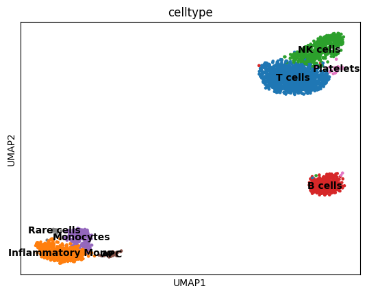
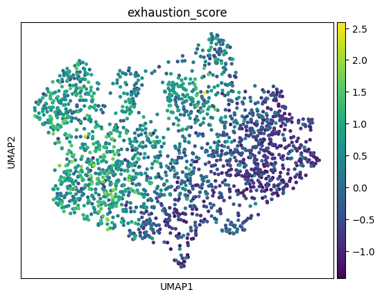
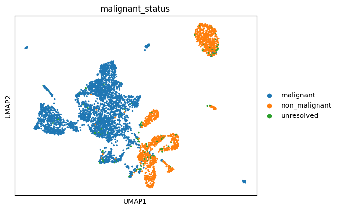
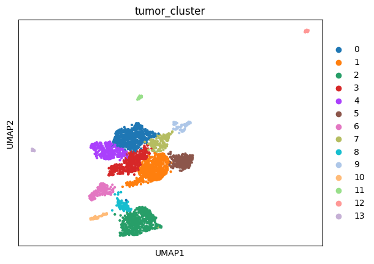

# Melanoma Single-Cell RNA-seq Analysis

Single-cell transcriptomic analysis of the melanoma tumour microenvironment using **Python**, **Scanpy**, and unsupervised clustering.

This project investigates:

- T-cell exhaustion states
- Tumour heterogeneity
- Melanoma lineage programs
- Proliferative tumour subpopulations
- Stress and plasticity signatures

---

## Project Overview

Melanoma contains diverse tumour and immune cell states that influence disease progression, immune evasion, and response to therapy.

Using publicly available single-cell RNA-seq data, this project implements an end-to-end analysis workflow to characterize the melanoma tumour microenvironment at single-cell resolution.

The analysis combines clustering, cell-type annotation, exhaustion scoring, and tumour-state characterization to identify biologically meaningful cellular populations and transcriptional programs.

---

## Project Highlights

✔ Single-cell RNA-seq analysis using Scanpy

✔ Tumour microenvironment characterization

✔ Cell-type annotation using marker genes

✔ T-cell exhaustion scoring

✔ Melanoma lineage-state analysis

✔ UMAP visualization and clustering

✔ Tumour heterogeneity analysis

✔ Reproducible Python workflow

---

## Main Results

### Cell Type Annotation

Identification of major cellular populations within the melanoma tumour microenvironment.



---

### T-cell Exhaustion Landscape

Visualization of exhaustion-associated transcriptional programs across T-cell populations.



---

### Malignant Cell Identification

Classification of malignant and non-malignant cellular populations.



---

### Tumour Cell States

Identification of transcriptionally distinct melanoma tumour subpopulations.



---

## Research Questions

1. What immune cell populations are present in the melanoma microenvironment?
2. Can exhausted T-cell populations be identified using checkpoint markers?
3. What transcriptional programs characterize melanoma tumour cells?
4. Is there evidence of proliferative or dedifferentiated tumour states?
5. How does tumour heterogeneity manifest at single-cell resolution?

---

## Biological Findings

### Tumour Microenvironment Mapping

Unsupervised clustering identified multiple cell populations including:

- T cells
- B cells
- NK cells
- Macrophages
- Endothelial cells
- Cancer-associated fibroblasts (CAFs)
- Tumour cells

Cell identities were assigned using canonical marker genes and UMAP visualization.

---

### T-cell Exhaustion Analysis

A custom exhaustion score was calculated using established immune checkpoint genes:

- PDCD1
- LAG3
- TOX
- TIGIT
- HAVCR2
- CTLA4

The analysis revealed heterogeneous T-cell functional states, with subsets displaying elevated exhaustion-associated signatures.

---

### Tumour Heterogeneity Analysis

Melanoma tumour cells were characterized using lineage-associated markers:

- PMEL
- TYR
- DCT
- MITF

Several transcriptional programs were observed.

#### Melanocytic State

High expression of:

- PMEL
- TYR
- DCT

#### Proliferative State

Enrichment of:

- PCNA

#### Stress Response State

Variable expression of:

- FOS

#### Plastic / Dedifferentiated State

Partial expression of:

- VIM

These findings demonstrate substantial intratumoral heterogeneity within melanoma cell populations.

---

## Analysis Workflow

1. Load scRNA-seq expression matrix
2. Create AnnData object
3. Import metadata
4. Quality control
5. Normalization and log transformation
6. Highly variable gene selection
7. Principal Component Analysis (PCA)
8. Nearest-neighbor graph construction
9. UMAP embedding
10. Leiden clustering
11. Marker gene analysis
12. Exhaustion signature scoring
13. Tumour-state characterization
14. Biological interpretation

---

## Repository Structure

```text
melanoma-single-cell-analysis/
│
├── notebooks/
│   ├── 01_start.ipynb
│   └── 02_melanoma_project.ipynb
│
├── figures/
│   ├── malignant_status.png
│   ├── umap_celltypes.png
│   ├── umap_exhaustion.png
│   ├── umap_malignant_status.png
│   └── umap_tumor_clusters.png
│
├── Melanoma Project.pdf
│
└── README.md
```

---

## Technologies and Libraries

### Programming

- Python

### Single-Cell Analysis

- Scanpy
- AnnData

### Data Science

- Pandas
- NumPy

### Visualization

- Matplotlib

### Development Environment

- Jupyter Notebook

---

## Skills Demonstrated

### Single-Cell Bioinformatics

- scRNA-seq analysis
- Cell-type annotation
- UMAP visualization
- Clustering analysis
- Signature scoring

### Cancer Genomics

- Tumour heterogeneity analysis
- T-cell exhaustion profiling
- Tumour microenvironment characterization
- Marker-gene interpretation

### Computational Biology

- Transcriptomic analysis
- Biological data visualization
- Reproducible research workflows
- Data-driven biological interpretation

### Tools

- Python
- Scanpy
- Pandas
- NumPy
- Matplotlib
- Jupyter

---

## Future Extensions

Potential future improvements include:

- Differential expression analysis
- Pseudotime trajectory analysis
- Cell-cell communication analysis (CellChat / CellPhoneDB)
- Gene regulatory network analysis
- Survival-associated transcriptomic signatures
- Multi-omics integration
- External dataset validation

---

## Key Takeaway

This project demonstrates how single-cell transcriptomics can be used to dissect the melanoma tumour microenvironment, identify exhausted immune populations, and characterize tumour heterogeneity at cellular resolution.

The results highlight the value of scRNA-seq for studying tumour biology and generating hypotheses for future cancer research.

---

## Author

**Agata Gabara**

Incoming MSc Bioinformatics Student

Research Interests:

- Cancer Genomics
- Single-Cell Transcriptomics
- Tumour Microenvironment Biology
- Computational Oncology
- Multi-Omics Integration

GitHub: https://github.com/ag48665

LinkedIn: https://www.linkedin.com/in/agatha-gabara-06494a37/

---

## License

This repository is provided for educational and research portfolio purposes.
